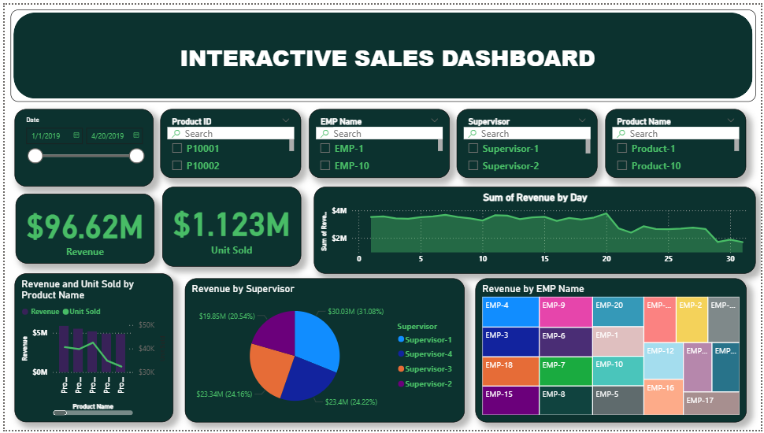

# Interactive_Sales_Dashboard

# Interactive Sales Dashboard 📊  

  
  

## 📌 Project Overview  
The **Interactive Sales Dashboard** is a Power BI report designed to track, analyze, and visualize sales performance across multiple dimensions.  
It provides actionable insights into revenue trends, regional sales distribution, product performance, and customer segmentation.  

## 🚀 Features  
- 💰 **Revenue & Profit Trends (Yearly / Monthly)**  
- 🌍 **Region-wise & Country-wise Sales Analysis**  
- 📦 **Product Category & Sub-category Insights**  
- 👥 **Customer Demographics & Purchase Behavior**  
- 📊 **KPIs for Total Sales, Profit Margin, and Growth %**  
- 🔍 **Interactive filters, slicers, and drill-through analysis**  

## 📂 File  
- `Interactive Sales Dashboard.pbix` → Power BI file containing the complete dashboard  

## 🛠️ Tech Stack  
- **Tool:** Power BI  
- **Data Source:** (Replace with your dataset details, e.g., Excel/SQL/CSV/Database)  
- **Techniques Used:** Data modeling, DAX measures, calculated columns, custom KPIs, interactive visuals  

## 📷 Dashboard Preview  
(Add screenshots of your Power BI dashboard here)  

  
 

## 📥 How to Use  
1. Clone this repository  
   ```bash
   git clone https://github.com/your-username/interactive-sales-dashboard.git
Open the .pbix file in Power BI Desktop

Update data source paths if required

Interact with filters and drill-down options to explore insights

## 📊 Insights Derived
- Identified top-performing regions and products

- Analyzed sales contribution across customer segments

- Profit margin analysis by category & sub-category

- Month-over-month sales trend analysis

## 🔮 Future Scope
- Integration with real-time sales databases (SQL, ERP, CRM)

- Forecasting future sales using advanced Power BI AI visuals

- Automated scheduled refresh through Power BI Service

##🤝 Contributing
- Contributions are welcome! Fork the repo, make your changes, and submit a pull request.
